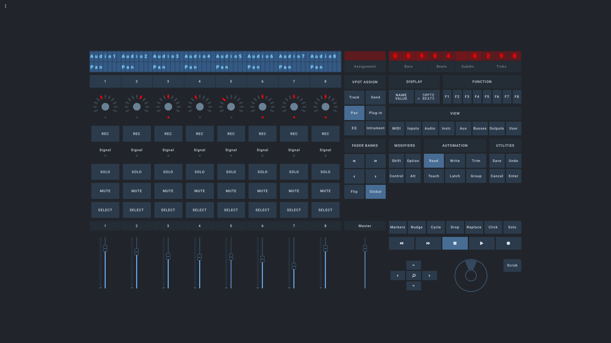

## Open Stage Control MCU

This is a proof-of-concept emulation of an MCU with Open Stage Control, based on https://github.com/NicoG60/OscMackieControl.

## Usage

Open Stage Control config:
- `midi`: `osc_mcu:virtual sysex` (replace `virtual` with port numbers if needed)
- `load`: `path/to/mcu.json`
- `custom-module`: `path/to/mcu.js`

OSC<->MCU translation is handled in the custom module. Widgets must have the midi target defined in `mcu.js` and in the server configuration to send/receive mcu messages.

Minimum resolution: 1366x768



## OSC Reference

```
### DISPLAY CONTROLS

/timecode <digit: 0-9> <value: string>
/lcd <position: 0-111> <value: string>

### TRANSPORT CONTROLS

/scrub_wheel <value: -1/1>

### FADERS / METERS / KNOBS

/fader_touch <channel: 1-8> <value: 0/1>
/fader <channel: 1-9> <value: 0-1>

/vu_meter <channel: 1-8> <value: 0-1>
/vu_meter_mode  <channel: 1-8> <value: 0/1 (off/on)>

/led_signal <channel: 1-8> <value: 0/1>

/vpot_rotate <value: -1/1>
/vpot_led <channel: 1-8> <led1: 0/1> <...>  <led12: 0/1>


### CHANNEL BUTTONS

/rec <channel: 1-8> <value: 0/1>
/solo <channel: 1-8> <value: 0/1>
/mute <channel: 1-8> <value: 0/1>
/sel <channel: 1-8> <value: 0/1>
/vpot_click <channel: 1-8> <value: 0/1>


### VPOT ASSIGN

/assign_track <value: 0/1>
/assign_send <value: 0/1>
/assign_pan <value: 0/1>
/assign_plugin <value: 0/1>
/assign_eq <value: 0/1>
/assign_instrument <value: 0/1>

### FADER BANKS
/bank_left <value: 0/1>
/bank_right <value: 0/1>
/bank_channel_left <value: 0/1>
/bank_channel_right <value: 0/1>
/bank_flip <value: 0/1>
/bank_global <value: 0/1>

### DISPLAY
/display_name_value <value: 0/1>
/display_smpte_beats <value: 0/1>

### FUNCTION SELECT
/f1 <value: 0/1>
/f2 <value: 0/1>
/f3 <value: 0/1>
/f4 <value: 0/1>
/f5 <value: 0/1>
/f6 <value: 0/1>
/f7 <value: 0/1>
/f8 <value: 0/1>

### GLOBAL VIEW
/view_midi_tracks <value: 0/1>
/view_inputs <value: 0/1>
/view_audio_tracks <value: 0/1>
/view_audio_instruments <value: 0/1>
/view_aux <value: 0/1>
/view_busses <value: 0/1>
/view_outputs <value: 0/1>
/view_user <value: 0/1>

### MODIFIERS
/mod_shift <value: 0/1>
/mod_option <value: 0/1>
/mod_control <value: 0/1>
/mod_alt <value: 0/1>

### AUTOMATION
/automation_read <value: 0/1>
/automation_write <value: 0/1>
/automation_trim <value: 0/1>
/automation_touch <value: 0/1>
/automation_latch <value: 0/1>
/automation_group <value: 0/1>

### UTILITIES
/save <value: 0/1>
/undo <value: 0/1>
/cancel <value: 0/1>
/enter <value: 0/1>

### MISC
/markers <value: 0/1>
/nudge <value: 0/1>
/cycle <value: 0/1>
/drop <value: 0/1>
/replace <value: 0/1>
/click <value: 0/1>
/global_solo <value: 0/1>

### TRANSPORT
/rewind <value: 0/1>
/forward <value: 0/1>
/stop <value: 0/1>
/play <value: 0/1>
/record <value: 0/1>
/up <value: 0/1>
/down <value: 0/1>
/scrub <value: 0/1>
/zoom <value: 0/1>
/left <value: 0/1>
/right <value: 0/1>

### LEDS
/led_smpte <value: 0/1>
/led_beats <value: 0/1>
/led_solo <value: 0/1>
```
